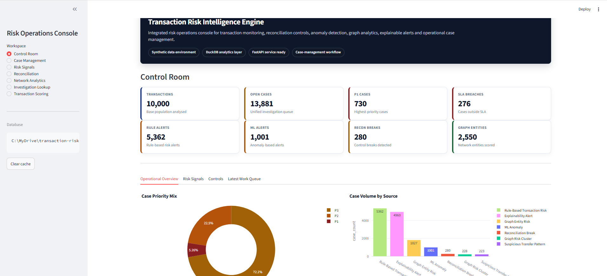
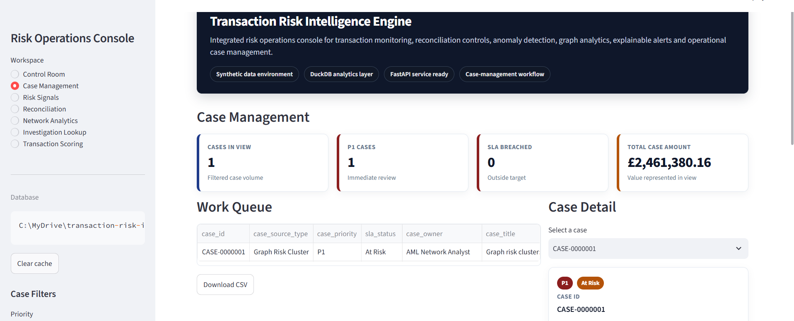
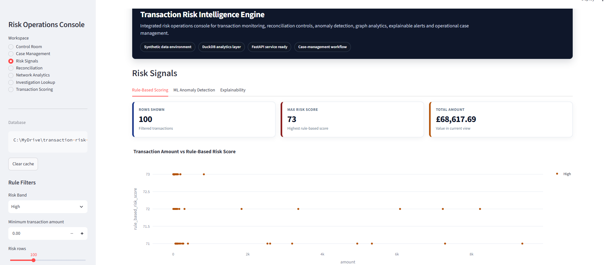
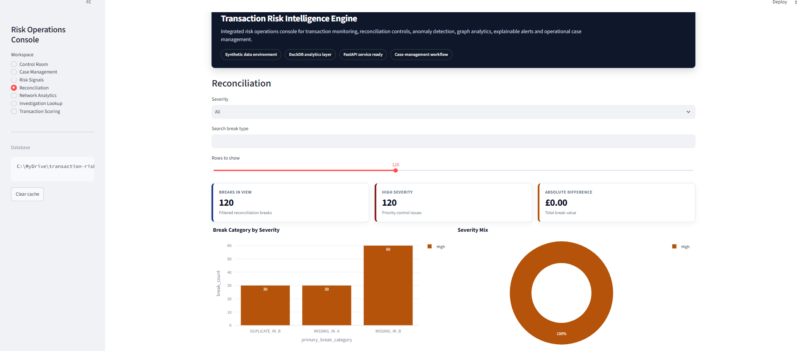
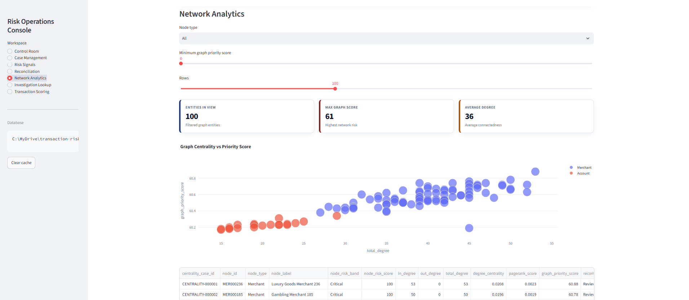
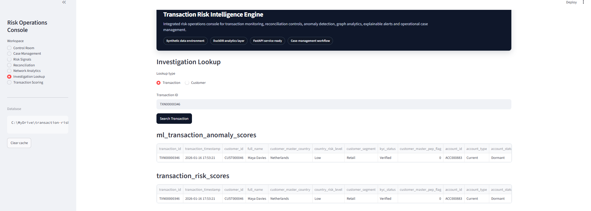
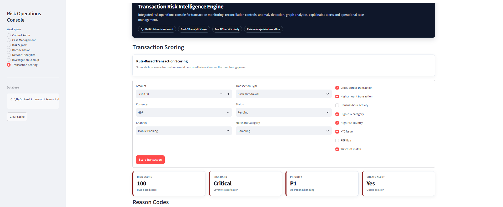
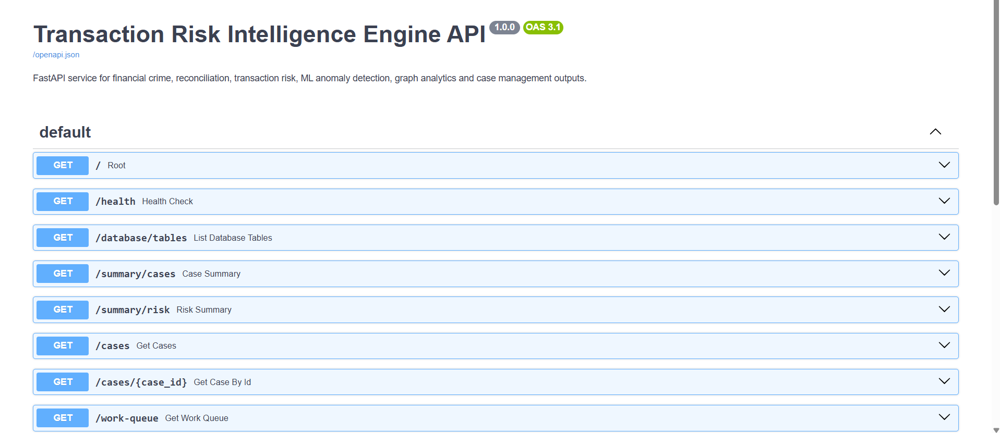

# Transaction Risk Intelligence Engine

A production-style transaction risk intelligence system for financial crime monitoring, reconciliation controls, anomaly detection, graph analytics, explainable alerting, case management, API delivery and dashboard reporting.

This project simulates a financial services environment where customer, account, merchant and transaction data must be monitored for suspicious behaviour, reconciliation breaks, risky entity relationships and operational investigation priorities.

---

## Project Objective

The objective of this project is to build an end-to-end transaction risk analytics system that can:

* generate realistic synthetic financial datasets
* load data into a structured analytical database
* detect reconciliation breaks between two financial systems
* validate data quality across core entities
* apply transparent rule-based transaction risk scoring
* detect unusual transaction behaviour using machine learning
* explain alerts in plain English for analyst review
* identify risky connected entities using graph analytics
* create a unified operational case-management queue
* expose outputs through a FastAPI service
* provide an interactive Streamlit risk operations console
* support reproducible execution locally and with Docker

---

## Business Problem

Financial services teams process large volumes of transactions across multiple internal and external systems. Some transactions may be suspicious, some records may fail reconciliation, and some customers, accounts or merchants may be connected through risky networks.

Operational teams need more than raw alerts. They need prioritised cases, clear reasons for escalation, supporting evidence, SLA visibility and a workflow that helps analysts focus on the highest-risk activity first.

This project addresses that problem by combining reconciliation controls, data quality validation, rule-based risk scoring, machine learning anomaly detection, graph analytics, explainable alerting and operational case management in one integrated system.

---

## Core Capabilities

* Synthetic financial data generation
* DuckDB analytical database layer
* Data quality validation
* Reconciliation break detection
* Rule-based transaction risk scoring
* Customer-level risk scoring
* Isolation Forest anomaly detection
* Human-readable alert explanations
* NetworkX graph analytics
* Suspicious transfer pattern detection
* Unified case-management work queue
* FastAPI service layer
* Streamlit risk operations dashboard
* Docker and Docker Compose support

---

## Technology Stack

| Area             | Tools                          |
| ---------------- | ------------------------------ |
| Programming      | Python                         |
| Data Processing  | pandas, NumPy                  |
| Database         | DuckDB, SQL                    |
| Machine Learning | scikit-learn, Isolation Forest |
| Graph Analytics  | NetworkX                       |
| API              | FastAPI, Uvicorn               |
| Dashboard        | Streamlit, Plotly              |
| Deployment       | Docker, Docker Compose         |
| Version Control  | Git, GitHub                    |

---

## Project Architecture

```text
Synthetic Financial Data
        ↓
DuckDB Database Layer
        ↓
Data Quality Validation
        ↓
Reconciliation Engine
        ↓
Rule-Based Risk Scoring
        ↓
ML Anomaly Detection
        ↓
Explainability Layer
        ↓
Graph Analytics
        ↓
Unified Case Management
        ↓
FastAPI Service Layer
        ↓
Streamlit Risk Operations Dashboard
        ↓
Dockerised Local Execution
```

---

## Dashboard Preview

The Streamlit dashboard provides a risk operations console for reviewing case queues, transaction risk signals, reconciliation breaks, entity network risk, investigation lookups and transaction scoring.

### Control Room



### Case Management



### Risk Signals



### Reconciliation



### Network Analytics



### Investigation Lookup



### Transaction Scoring



---

## API Preview

The FastAPI layer exposes the main project outputs through documented API endpoints.



---

## Project Stages

### Stage 0: Project Setup and GitHub Foundation

Created the project repository, folder structure, starter files and GitHub connection.

Main folders include:

* data
* notebooks
* src
* sql
* reports
* dashboards
* api
* tests
* docs
* scripts

---

### Stage 1: Synthetic Financial Data Generation

Created synthetic datasets for transaction monitoring, reconciliation and financial crime analytics.

Generated datasets include:

* customers
* merchants
* accounts
* transactions
* account-to-account transfers
* watchlist records
* reconciliation file A
* reconciliation file B

The generator injects controlled risk patterns such as high-value payments, unusual-hour activity, cross-border transactions, high-risk merchant categories, watchlist exposure and reconciliation breaks.

Run:

```powershell
python src\data_generation\generate_synthetic_data.py
```

Outputs:

```text
data/synthetic/
```

---

### Stage 2: DuckDB Database Layer

Loads the synthetic CSV files into a local DuckDB analytical database and creates SQL views for downstream analysis.

Created database objects include:

* customers table
* merchants table
* accounts table
* transactions table
* account_transfers table
* watchlist table
* reconciliation_file_a table
* reconciliation_file_b table
* vw_transaction_enriched view
* vw_daily_transaction_summary view
* vw_reconciliation_overview view

Run:

```powershell
python src\database\build_duckdb_database.py
```

Database output:

```text
data/processed/transaction_risk.duckdb
```

---

### Stage 3: Reconciliation Engine

Compares two synthetic reconciliation files representing records from two financial systems.

The reconciliation engine detects:

* missing records
* duplicate records
* amount mismatches
* date mismatches
* currency mismatches
* account mismatches
* status mismatches
* matched records

Run:

```powershell
python src\reconciliation\run_reconciliation.py
```

Outputs include:

* reconciliation_results table
* reconciliation_breaks table
* vw_reconciliation_break_summary view
* stage3 reconciliation reports

---

### Stage 4: Data Quality Validation

Adds a validation layer across customer, account, merchant, transaction and reconciliation data.

Checks include:

* missing IDs
* duplicate IDs
* invalid references
* negative transaction amounts
* invalid statuses
* invalid currencies
* reconciliation file quality issues
* controlled duplicate reconciliation records

Run:

```powershell
python src\data_quality\run_data_quality_checks.py
```

Outputs include:

* data_quality_results table
* vw_data_quality_summary view
* stage4 data quality reports

---

### Stage 5: Rule-Based Risk Scoring

Adds transparent rule-based transaction and customer risk scoring.

Risk indicators include:

* watchlist matches
* PEP flags
* KYC issues
* high-risk countries
* high-risk merchant categories
* high-value transactions
* cross-border transactions
* unusual-hour activity
* failed or reversed transaction statuses
* risky rule combinations

Run:

```powershell
python src\risk_scoring\run_rule_based_risk_scoring.py
```

Outputs include:

* transaction_risk_scores table
* customer_risk_scores table
* transaction_risk_alerts table
* vw_transaction_risk_summary view
* vw_customer_risk_summary view

---

### Stage 6: Machine Learning Anomaly Detection

Adds unsupervised anomaly detection using Isolation Forest.

The model uses transaction, customer, merchant, channel and rule-based risk features to identify unusual transaction behaviour.

Run:

```powershell
python src\ml\run_anomaly_detection.py
```

Outputs include:

* ml_transaction_anomaly_scores table
* ml_transaction_anomaly_alerts table
* ml_customer_anomaly_summary table
* vw_ml_anomaly_summary view
* vw_ml_vs_rule_summary view

---

### Stage 7: Explainability Layer

Converts rule-based risk triggers, ML anomaly outputs and reconciliation evidence into analyst-friendly explanations.

Each explanation includes:

* transaction ID
* customer details
* main trigger
* combined explanation score
* rule-based reason codes
* ML reason codes
* reconciliation evidence where available
* plain-English explanation
* recommended investigation action

Run:

```powershell
python src\explainability\run_explainability_layer.py
```

Outputs include:

* alert_explanations table
* explanation_reason_summary table
* customer_explanation_summary table
* vw_explainability_priority_summary view
* vw_top_explanation_reasons view

---

### Stage 8: Graph Analytics

Adds graph analytics using NetworkX to identify connected entities, risky clusters and suspicious transfer patterns.

The graph represents relationships between:

* customers
* accounts
* merchants
* account-to-account transfers

The graph analytics layer detects:

* high-risk connected components
* high-centrality entities
* risky customers, accounts and merchants
* reciprocal transfer patterns
* high outbound transfer hubs
* high inbound collection hubs
* watchlist-linked graph clusters

Run:

```powershell
python src\graph\run_graph_analytics.py
```

Outputs include:

* graph_nodes table
* graph_edges table
* graph_risk_clusters table
* graph_suspicious_transfer_patterns table
* graph_high_centrality_entities table
* vw_graph_entity_risk_summary view
* vw_graph_cluster_summary view

---

### Stage 9: Alert Case Management

Creates a unified operational case-management layer across reconciliation, rule-based risk scoring, ML anomaly detection, explainability and graph analytics.

The case-management layer combines alerts from:

* reconciliation breaks
* rule-based transaction risk alerts
* ML anomaly alerts
* explainability alerts
* high-centrality graph entities
* suspicious transfer patterns
* graph risk clusters

Run:

```powershell
python src\case_management\run_case_management.py
```

Outputs include:

* case_management_cases table
* case_management_summary table
* case_management_work_queue table
* vw_case_management_priority_summary view
* vw_case_management_source_summary view
* vw_case_management_owner_queue view

---

### Stage 10: FastAPI Service Layer

Adds an API layer so project outputs can be accessed through documented endpoints.

Run:

```powershell
uvicorn api.main:app --reload
```

Open:

```text
http://127.0.0.1:8000/docs
```

Main endpoints include:

* GET /health
* GET /database/tables
* GET /summary/cases
* GET /summary/risk
* GET /cases
* GET /cases/{case_id}
* GET /work-queue
* GET /transactions/{transaction_id}
* GET /customers/{customer_id}/risk
* GET /alerts/explanations
* GET /reconciliation/breaks
* GET /graph/entities
* GET /graph/transfer-patterns
* POST /score-transaction

---

### Stage 11: Streamlit Risk Operations Dashboard

Adds an interactive dashboard for exploring project outputs.

Dashboard workspaces include:

* Control Room
* Case Management
* Risk Signals
* Reconciliation
* Network Analytics
* Investigation Lookup
* Transaction Scoring

Run:

```powershell
streamlit run dashboards\streamlit_app.py
```

Open:

```text
http://localhost:8501
```

The dashboard includes:

* professional financial-services styling
* muted risk colour grading
* integrated operational navigation
* interactive Plotly charts
* searchable case-management queues
* analyst-style drill-downs
* investigation lookup
* downloadable filtered CSV outputs
* transaction scoring form

---

### Stage 12: Docker and Final Project Polish

Adds Docker support, Docker Compose and a full pipeline runner.

Run the full pipeline locally:

```powershell
python scripts\run_full_pipeline.py
```

Build Docker image:

```powershell
docker build -t transaction-risk-intelligence-engine .
```

Run full pipeline inside Docker:

```powershell
docker run --rm transaction-risk-intelligence-engine
```

Run API and dashboard using Docker Compose:

```powershell
docker compose up --build
```

Then open:

```text
http://127.0.0.1:8000/docs
```

for the API, and:

```text
http://127.0.0.1:8501
```

for the dashboard.

---

## Generated Reports

The project generates CSV and JSON outputs inside:

```text
reports/
```

Report outputs include:

* table counts
* data quality checks
* reconciliation results
* reconciliation breaks
* transaction risk scores
* customer risk scores
* ML anomaly scores
* ML anomaly alerts
* alert explanations
* graph nodes and edges
* graph risk clusters
* suspicious transfer patterns
* case-management work queue
* case-management summaries

---

## Project Structure

```text
transaction-risk-intelligence-engine/
│
├── api/
│   ├── main.py
│   └── README.md
│
├── dashboards/
│   ├── streamlit_app.py
│   └── README.md
│
├── data/
│   ├── raw/
│   ├── processed/
│   └── synthetic/
│
├── docs/
│   ├── ARCHITECTURE.md
│   ├── PORTFOLIO_SUMMARY.md
│   ├── PROJECT_OVERVIEW.md
│   ├── RUN_GUIDE.md
│   └── screenshots/
│
├── reports/
│
├── scripts/
│   └── run_full_pipeline.py
│
├── sql/
│
├── src/
│   ├── case_management/
│   ├── data_generation/
│   ├── data_quality/
│   ├── database/
│   ├── explainability/
│   ├── graph/
│   ├── ml/
│   ├── reconciliation/
│   ├── risk_scoring/
│   └── utils/
│
├── tests/
│
├── Dockerfile
├── docker-compose.yml
├── requirements.txt
└── README.md
```

---

## How to Run

### 1. Clone the repository

```powershell
git clone https://github.com/ameerhamzarashid/transaction-risk-intelligence-engine.git
cd transaction-risk-intelligence-engine
```

### 2. Create virtual environment

```powershell
python -m venv .venv
```

### 3. Activate virtual environment

```powershell
.\.venv\Scripts\Activate.ps1
```

If PowerShell blocks activation, run:

```powershell
Set-ExecutionPolicy -ExecutionPolicy RemoteSigned -Scope CurrentUser
```

Then activate again:

```powershell
.\.venv\Scripts\Activate.ps1
```

### 4. Install dependencies

```powershell
pip install -r requirements.txt
```

### 5. Run full pipeline

```powershell
python scripts\run_full_pipeline.py
```

Expected final output:

```text
Full pipeline completed successfully
```

### 6. Run dashboard

```powershell
streamlit run dashboards\streamlit_app.py
```

Open:

```text
http://localhost:8501
```

### 7. Run API

```powershell
uvicorn api.main:app --reload
```

Open:

```text
http://127.0.0.1:8000/docs
```

---

## Docker Run

Make sure Docker Desktop is running.

Build image:

```powershell
docker build -t transaction-risk-intelligence-engine .
```

Run pipeline inside Docker:

```powershell
docker run --rm transaction-risk-intelligence-engine
```

Run API and dashboard:

```powershell
docker compose up --build
```

Open:

```text
http://127.0.0.1:8000/docs
```

and:

```text
http://127.0.0.1:8501
```

Stop services:

```powershell
docker compose down
```

---

## Documentation

Additional documentation:

* [Run Guide](docs/RUN_GUIDE.md)
* [Architecture](docs/ARCHITECTURE.md)
* [Project Overview](docs/PROJECT_OVERVIEW.md)
* [Portfolio Summary](docs/PORTFOLIO_SUMMARY.md)
* [API Guide](api/README.md)
* [Dashboard Guide](dashboards/README.md)

---

## Skills Demonstrated

This project demonstrates:

* Python data engineering
* SQL analytics
* DuckDB database modelling
* data quality validation
* reconciliation control logic
* financial crime risk scoring
* fraud and AML-style transaction monitoring
* machine learning anomaly detection
* graph analytics
* explainable alerting
* operational case management
* API development
* dashboard development
* Docker-based reproducibility
* GitHub project organisation

---

## CV-Ready Project Summary

Transaction Risk Intelligence Engine – Fraud, Reconciliation and Graph Analytics

Built a production-style financial crime analytics engine using Python, DuckDB, SQL, scikit-learn, NetworkX, FastAPI and Streamlit to detect suspicious transactions, reconciliation breaks, risky entity clusters and operational alerts. Implemented synthetic financial data generation, rule-based risk scoring, Isolation Forest anomaly detection, explainable alert reasoning, graph analytics and a case-management dashboard with Docker support.

---

## Notes

All data in this project is synthetic and created for demonstration purposes only. It does not contain real customer, account, banking or personal information.

The local DuckDB database and generated data files can be regenerated by running the pipeline.
